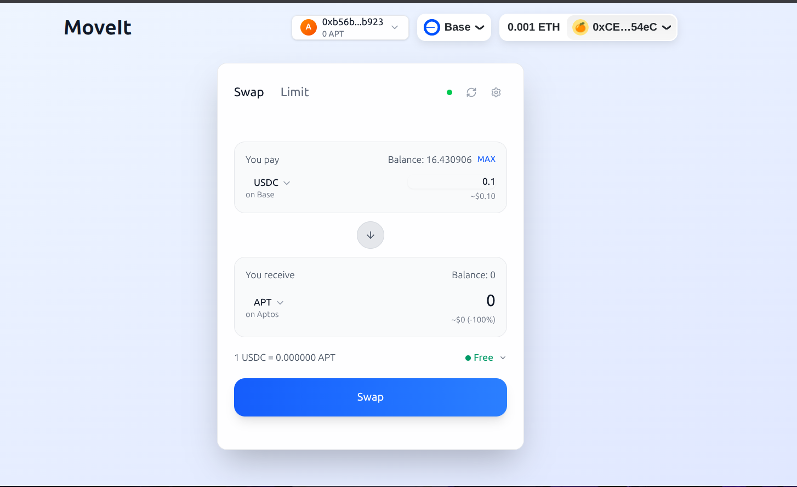
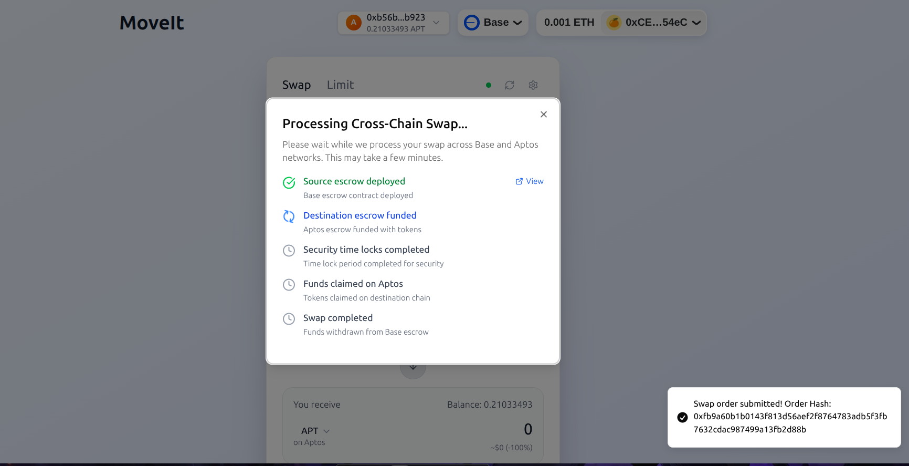
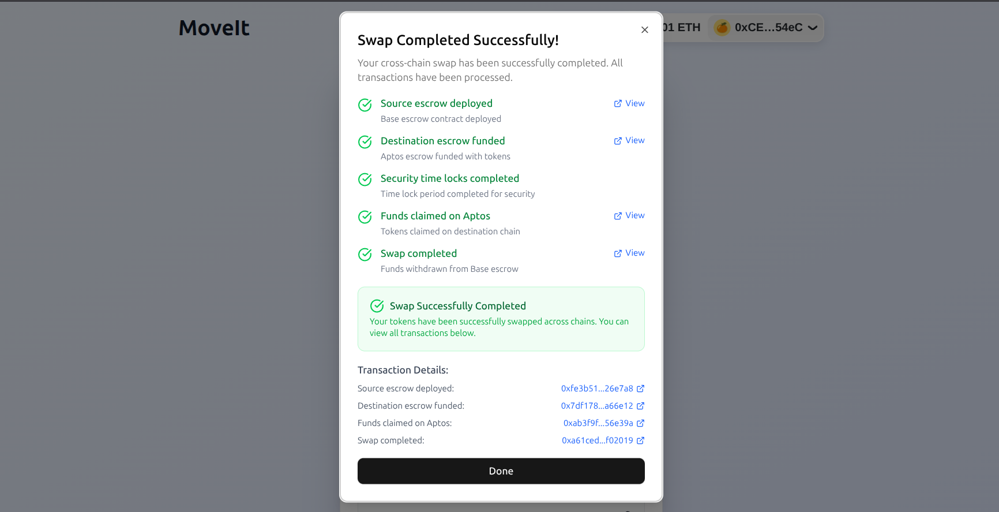
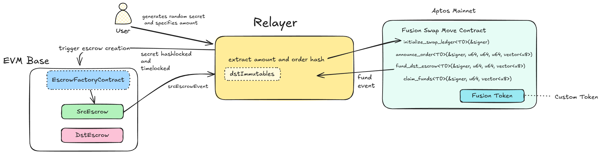

# Fusion+ Protocol - Aptos Implementation

Aptos implementation of the 1inch Fusion+ protocol for cross-chain atomic swaps between EVM chains and Aptos.

## MoveIt UI


*Cross-chain swap interface showing USDC on Base to APT on Aptos*


*Processing cross-chain swap with step-by-step progress tracking*


*Successfully completed cross-chain swap with transaction details*


*Aptos Implementation*

## Overview

The protocol uses hash-time-locked contracts (HTLC) with escrow accounts to enable secure cross-chain token swaps.

## Protocol Flow

1. **Order Announcement**: Maker deposits tokens into Aptos escrow with secret hash
2. **Destination Funding**: Resolver funds destination escrow on target EVM chain
3. **Claim**: Resolver reveals secret to claim maker's tokens from Aptos escrow
4. **Completion**: Maker claims resolver's tokens from EVM escrow using revealed secret

## Core Functions

- [`initialize_swap_ledger`](aptos/sources/fusion_swap.move#L66-L80): Setup swap ledger resource account
- [`announce_order`](aptos/sources/fusion_swap.move#L86-L140): Create swap order and escrow account
- [`fund_dst_escrow`](aptos/sources/fusion_swap.move#L151-L185): Fund destination escrow (resolver operation)
- [`claim_funds`](aptos/sources/fusion_swap.move#L202-L230): Claim funds using revealed secret
- [`cancel_swap`](aptos/sources/fusion_swap.move#L244-L270): Cancel expired order and return funds

## Example Transactions

### Deployed Contract
[Fusion Swap Contract](https://explorer.aptoslabs.com/account/0xb56bbecb1105320f538c98931eb637eb216e977bc4c6b83504c43663f4e6b923/modules/code/fusion_swap?network=mainnet)

### Claim Funds Transaction
[Claim Funds Example](https://explorer.aptoslabs.com/txn/0xd919b7d7856dbf1aa3a60e295845018ca072426e3a4f04458cc4385d57e57de4/userTxnOverview?network=mainnet)

### Fund Destination Escrow Transaction
[Fund DST Escrow Example](https://explorer.aptoslabs.com/txn/0xa0d7e09f4f5f4746feb6343646d4e10b551d95ed973b5b216af9f0efa512cad2/balanceChange?network=mainnet)

## Setup

```bash
cd aptos
npm install
```

Create `.env`:
```env
PRIVKEY=your_private_key_here
ADDR=your_aptos_address_here
```

## Usage

```typescript
// Initialize ledger
await initialize_swap_ledger();

// Create order
const secret = "my_secret_password";
const secretHash = ethers.keccak256(ethers.toUtf8Bytes(secret));
await announce_order(100, 100, 3600, secretHash);

// Fund destination escrow
await fund_dst_escrow(100, expirationTime, secretHash);

// Claim funds
await claim_funds(orderId, ethers.toUtf8Bytes(secret));

// Cancel expired order
await cancel_swap(orderId);
```

# Fusion+ Protocol - Sui Implementation

## Sui Setup

For local testing:

1. **Start a Sui node:**
   ```bash
   RUST_LOG="off,sui_node=info" sui start --with-faucet --force-regenesis
   ```

2. **Install dependencies for testing:**
   ```bash
   npm install ts-node @mysten/sui dotenv
   ```

- [Reference: How to use the Sui TypeScript SDK](https://dev.to/goodylili/how-to-use-the-sui-typescript-sdk-2dep)

## Implementation Overview

1. **EVM Chain (Chain A):**
   - Alice creates an escrow account, deposits tokens, and locks them on Chain A.
   - _Note: This step is not handled by Sui._

2. **Sui Chain (Chain B):**
   - Bob creates an escrow account on Chain B and locks tokens there.
   - This is performed by the `createEscrow` function, managed by the resolver.

3. **Claiming Tokens:**
   - After the escrow account is created on Chain B, the resolver claims the tokens on behalf of Alice.
   - Subsequently, Bob can claim the tokens on Chain A.

This flow ensures atomic swaps between EVM and Sui chains, with the resolver coordinating the escrow and claim processes.